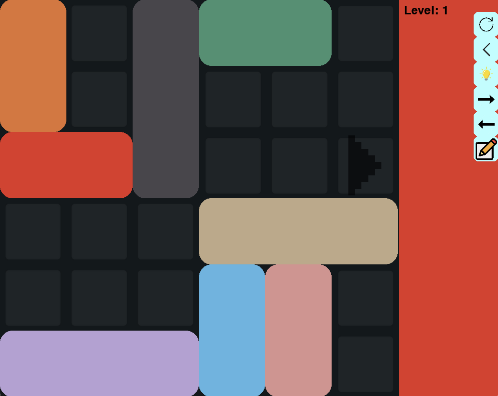
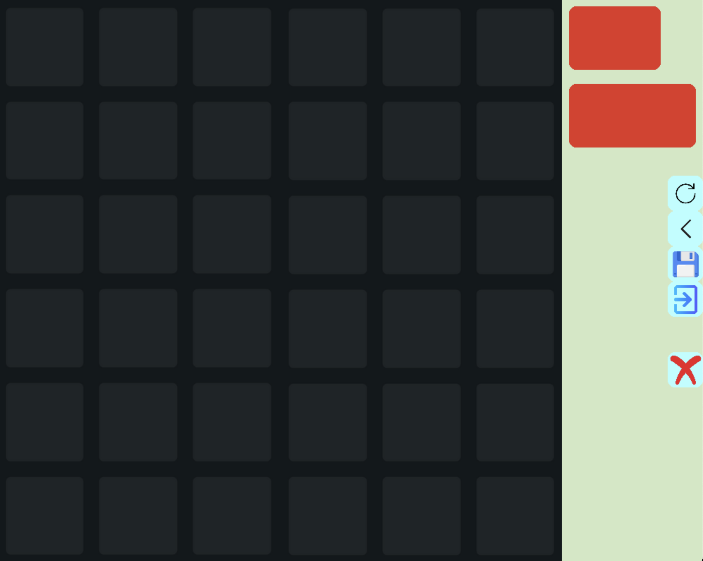

## Cài đặt & chạy game
### 1. Cài đặt thư viện
```bash
pip install -r requirements.txt
```

### 2. Chạy game
```bash
python RushHour/main.py (Windown)
python3 RushHour/main.py (Macos/Linux)
```


## Luật chơi
Mỗi hình chữ nhật đại diện cho một chiếc xe ô tô.
Bạn cần đưa xe ô tô màu đỏ đi tới mũi tên ở ngoài cùng bên phải.
Các xe chỉ có thể tiến hoặc lùi theo chiều của chiếc xe.

## Cách dùng
### Cách điều khiển
Dùng chuột: Sử dụng chuột nhấn giữ vào xe và kéo đi.
Dùng phím: Sử dụng phím tab để chọn xe cần di chuyển, dùng phím mũi tên để di chuyển xe theo hướng mong muốn.
### Các chức năng
Sử dụng phím **|** (trên phím enter/return) để ẩn/hiện chức năng.
Lần lượt từ trên xuống:
- Restart: Level hiện tại trở về vị trí ban đầu
- Back: Trở lại bước di chuyển trước
- Solve: Giải level hiện tại. Lời giải được in lên console. Các số thứ nhất đại diện cho các xe, số thứ hai đại diện cho di chuyển. Ví dụ (1, -2): xe đỏ đi về phía trái 2 ô.
- Next: Chuyển lên level tiếp theo.
- Pre: Chuyển xuống level trước.
- Custom: Tạo màn chơi. Kéo thả các xe vào khung. Sử dụng phím Space trong khi kéo để đổi hướng xe. Các nút lần lượt là: xoá toàn bộ; trở về một bước; Lưu; Thoát. Sử dụng phím **x** để ẩn/hiện nút xoá level.

